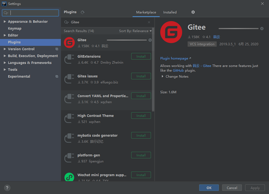

# git demo

#### 介绍
git 的简单学习，主要介绍git安装和简单的配置，包括github和gitee的配置，以及idea配置。

#### 安装
* git官网下载对应操作系统版本的git 
    *   下载地址为： https://git-scm.com/downloads

*   下载完毕后直接下一步安装

#### 配置
* 配置 全局/仓库 用户名和邮箱
    *   git config --global user.name "xxxxx"
    *   git config --global user.email "xxx@xxx.xx"
   
#### 生成 SSH Key
* ssh-keygen -o    或者  ssh-keygen -t rsa -C "xxxx@xxxx.xxx"
* 提示输入密码，这里我们不要设置密码，直接回车

#### 配置github / gitee 
* 将 C:\Users\LX\.ssh\id_rsa.pub 里的公钥 配置在github/gitee对应的ssh key中即可。
* ## **注意：id_rsa 文件是私钥** 

####  idea配置 gitee   https://gitee.com/all-about-git
* 安装gitee插件

* 重启 idea 然后配置账户

####  更多详情请参考：https://git-scm.com/doc   和  https://gitee.com/all-about-git