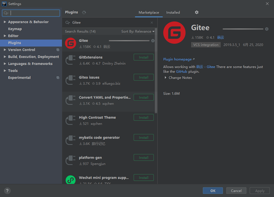
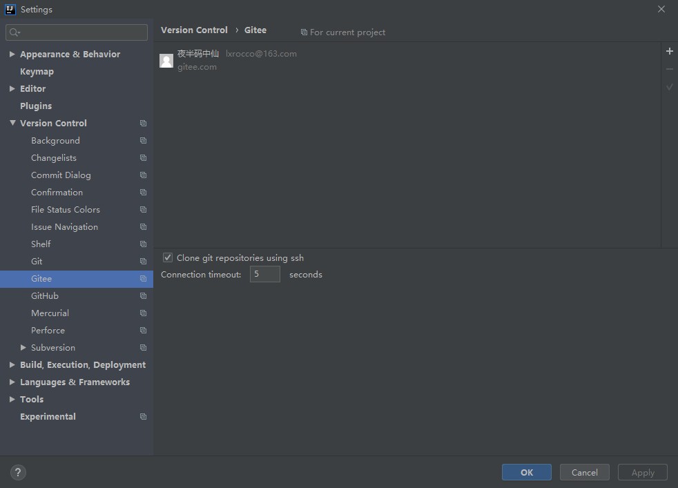
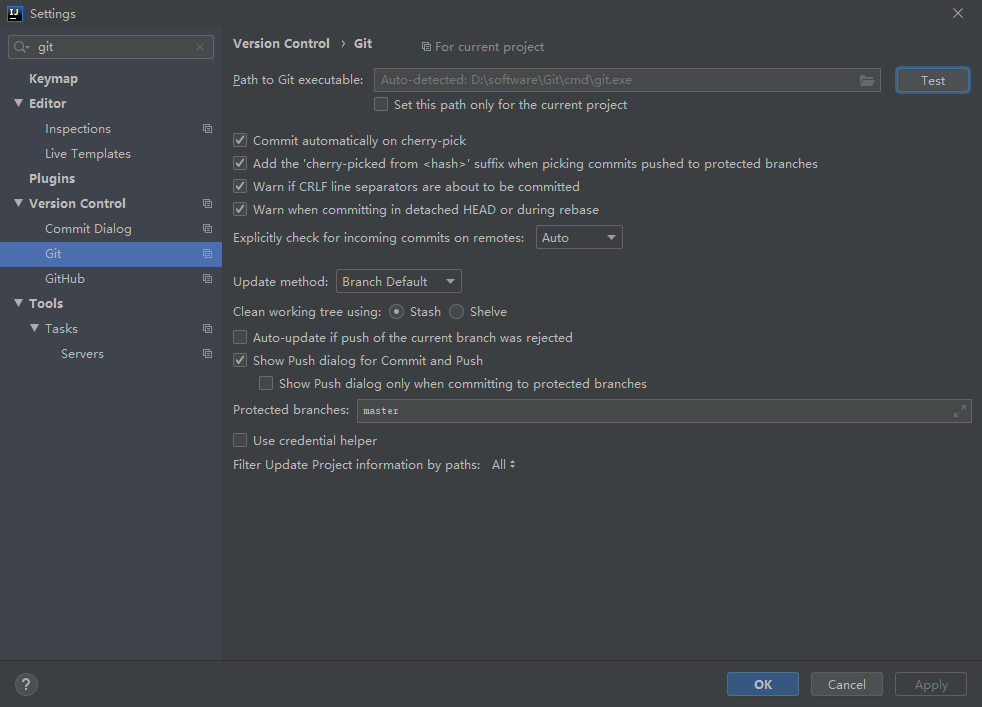
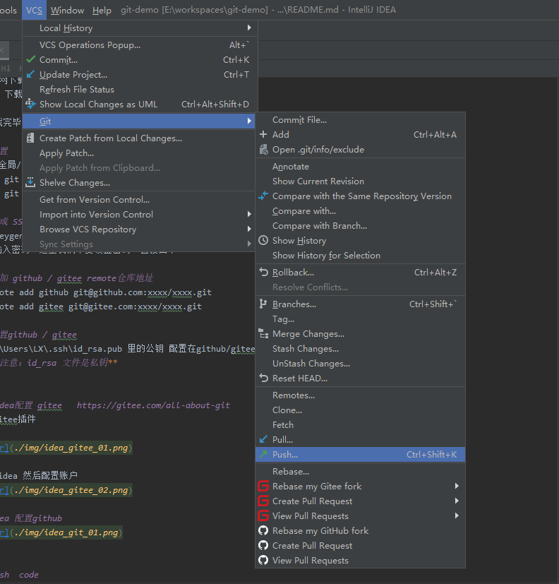
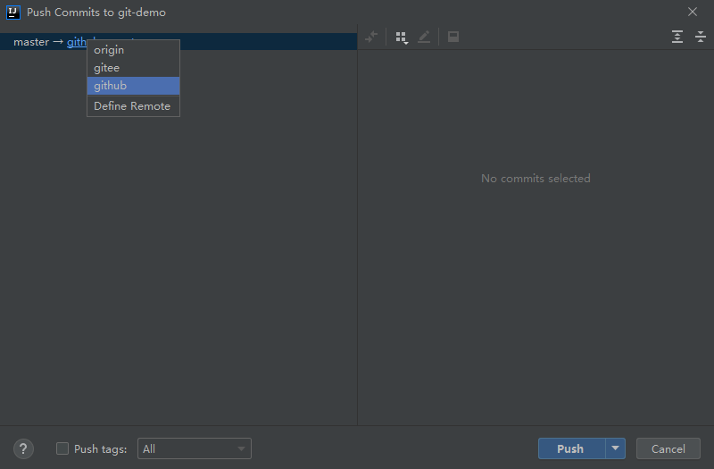

# git demo

#### 介绍
git 的简单学习，主要介绍git安装和简单的配置，包括github和gitee的配置，以及idea配置。

#### 安装
* git官网下载对应操作系统版本的git 
    *   下载地址为： https://git-scm.com/downloads

*   下载完毕后直接下一步安装

#### 配置
* 配置 全局/仓库 用户名和邮箱
    *   git config --global user.name "xxxxx"
    *   git config --global user.email "xxx@xxx.xx"
   
#### 生成 SSH Key
* ssh-keygen -o    或者  ssh-keygen -t rsa -C "xxxx@xxxx.xxx"
* 提示输入密码，这里我们不要设置密码，直接回车

#### 增加 github / gitee remote仓库地址
* git remote add github git@github.com:xxxx/xxxx.git
* git remote add gitee git@gitee.com:xxxx/xxxx.git
* 修改remote ：   git remote set-url github git@github.com:xxxx/xxxx.git 
* 更多操作如下：
    *   git remote [-v | --verbose]
    *   git remote add [-t <branch>] [-m <master>] [-f] [--tags | --no-tags] [--mirror=<fetch|push>] <name> <url>
    *   git remote rename <old> <new>
    *   git remote remove <name>
    *   git remote set-head <name> (-a | --auto | -d | --delete | <branch>)
    *   git remote [-v | --verbose] show [-n] <name>
    *   git remote prune [-n | --dry-run] <name>
    *   git remote [-v | --verbose] update [-p | --prune] [(<group> | <remote>)...]
    *   git remote set-branches [--add] <name> <branch>...
    *   git remote get-url [--push] [--all] <name>
    *   git remote set-url [--push] <name> <newurl> [<oldurl>]
    *   git remote set-url --add <name> <newurl>
    *   git remote set-url --delete <name> <url>

#### 配置github / gitee 
* 将 C:\Users\LX\.ssh\id_rsa.pub 里的公钥 配置在github/gitee对应的ssh key中即可。
* ## **注意：id_rsa 文件是私钥** 

####  idea配置 gitee   https://gitee.com/all-about-git
* 安装gitee插件

* 重启 idea 然后配置账户

#### idea 配置github

#### push  code

####  更多详情请参考：https://git-scm.com/doc   和  https://gitee.com/all-about-git